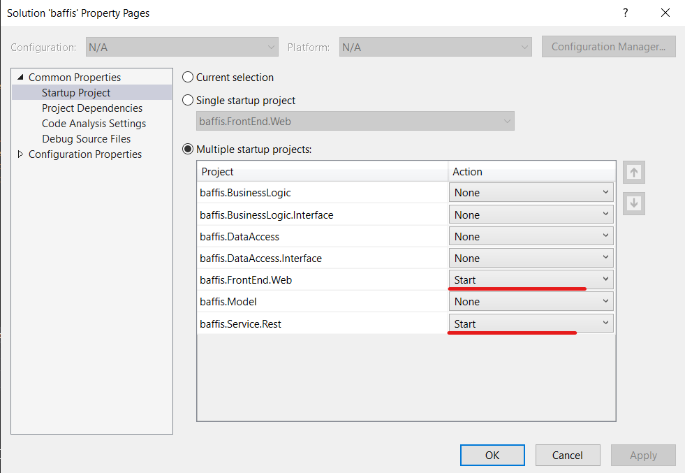

# Instructions to run app

1. Run the docker-compose of this project: [Baffis.Database](https://github.com/eddygarros/baffis.Database)
2. Open the solution on Visual Studio 2019 and set the startup projects like this:

